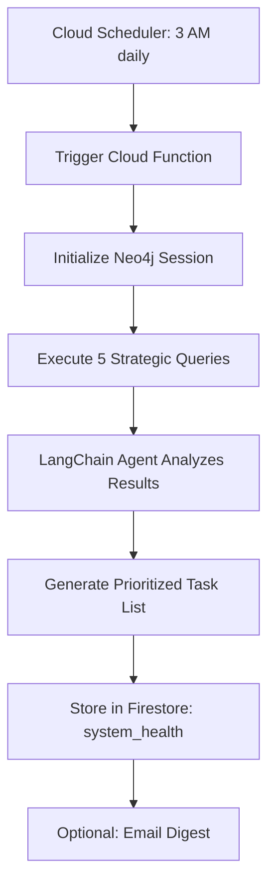

# Auditor Agent - Specification

**Purpose**: Autonomous system health monitoring using Neo4j graph queries - surfaces gaps, strategic opportunities, and operational inefficiencies

**Build Trigger**: Sprint 1 complete (Neo4j schema deployed, 100+ notes migrated)

---

## Overview

The Auditor Agent runs **nightly at 3 AM** (Cloud Scheduler) to analyze system health via Neo4j Cypher queries. It generates a prioritized task list based on:

- Stale targets (30+ days without update)
- Unvalidated T2/T3 hypotheses
- Warm intro paths to C4 buyers
- Learning impact validation
- Scope creep risks

**Agent Type**: Proactive (scheduled execution)  
**Execution Model**: Asynchronous (nightly cron)  
**Human-in-Loop**: Read-only (surfacing insights, not taking action)

---

## Architecture

### Tech Stack

```python
# Core dependencies
from neo4j import GraphDatabase
from langchain.agents import AgentExecutor, create_tool_calling_agent
from langchain_core.prompts import ChatPromptTemplate
from langchain_openai import ChatOpenAI
from langchain_core.tools import tool
import firebase_admin
from firebase_admin import firestore
from datetime import datetime

# LLM Router (Pattern 1 from ARCHITECTURE_PATTERNS.md)
class HierarchicalRouter:
    def __init__(self):
        self.quick_responder = ChatOpenAI(model="gpt-4o-mini", temperature=0)
        self.deep_thinker = ChatOpenAI(model="o1-mini", temperature=1)

    def route(self, complexity: str):
        return self.deep_thinker if complexity == "complex" else self.quick_responder
```

### Agent Flow



---

## Key Queries (Cypher)

### Query 1: Stale Targets

**Purpose**: Find Target Profiles not updated in 30+ days, prioritized by pipeline value

```cypher
MATCH (t:Target)
WHERE t.last_updated < date() - duration({days: 30})
  AND t.status IN ['engaged', 'qualified']
OPTIONAL MATCH (t)<-[:WORKS_AT]-(s:Stakeholder)
RETURN t.name AS target,
       t.priority,
       t.last_updated,
       duration.inDays(t.last_updated, date()).days AS staleness,
       collect(s.name) AS stakeholders,
       t.estimated_value AS pipeline_value
ORDER BY
  CASE t.priority
    WHEN 'strategic' THEN 1
    WHEN 'high' THEN 2
    WHEN 'medium' THEN 3
    ELSE 4
  END,
  staleness DESC
LIMIT 10
```

**Python Tool**:

```python
@tool
def query_stale_targets() -> str:
    """Finds Target Profiles not updated in 30+ days with priority weighting"""
    with driver.session() as session:
        result = session.run("""
            MATCH (t:Target)
            WHERE t.last_updated < date() - duration({days: 30})
              AND t.status IN ['engaged', 'qualified']
            OPTIONAL MATCH (t)<-[:WORKS_AT]-(s:Stakeholder)
            RETURN t.name AS target,
                   t.priority,
                   t.last_updated,
                   duration.inDays(t.last_updated, date()).days AS staleness,
                   collect(s.name) AS stakeholders,
                   t.estimated_value AS pipeline_value
            ORDER BY
              CASE t.priority
                WHEN 'strategic' THEN 1
                WHEN 'high' THEN 2
                WHEN 'medium' THEN 3
                ELSE 4
              END,
              staleness DESC
            LIMIT 10
        """)
        return [dict(record) for record in result]
```

---

### Query 2: Unvalidated T2/T3 Assumptions

**Purpose**: Find engaged targets with unvalidated technical/operational hypotheses

```cypher
MATCH (t:Target)
WHERE t.status = 'engaged'
  AND (t.t2_validated = false OR t.t3_validated = false)
OPTIONAL MATCH (t)<-[:WORKS_AT]-(s:Stakeholder)
OPTIONAL MATCH (t)<-[:VALIDATES]-(e:Note {type: 'engagement'})
RETURN t.name AS target,
       t.messy_problems,
       t.t2_validated,
       t.t3_validated,
       collect(DISTINCT s.name) AS stakeholders,
       count(DISTINCT e) AS engagement_count,
       t.estimated_value AS pipeline_value
ORDER BY engagement_count DESC, t.estimated_value DESC
LIMIT 10
```

---

### Query 3: Warm Intro Paths

**Purpose**: Discover network paths to C4 Economic Buyers (4+ hops possible)

```cypher
MATCH path = shortestPath(
    (me:Stakeholder {name: 'Principal'})
    -[:KNOWS*1..4]-
    (buyer:Stakeholder {type: 'C4'})
)
MATCH (buyer)-[:WORKS_AT]->(org:Target)
WHERE buyer.last_contact < date() - duration({days: 60})
  AND org.status IN ['research', 'qualified']
RETURN buyer.name AS economic_buyer,
       org.name AS target_org,
       [node IN nodes(path) | node.name] AS intro_path,
       length(path) AS path_length,
       org.messy_problems AS pain_points,
       org.priority AS priority,
       org.estimated_value AS pipeline_value
ORDER BY path_length ASC, org.estimated_value DESC
LIMIT 10
```

**Strategic Value**: This query is **impossible without Neo4j** - Firestore can't do 4-hop traversal efficiently.

---

### Query 4: Learning Impact Analysis

**Purpose**: Validate which learning principles correlate with successful outcomes

```cypher
MATCH (l:Learning)-[:APPLIED_IN]->(e:Note {type: 'engagement'})
WHERE e.cta_success IS NOT NULL AND e.sentiment IS NOT NULL
WITH l,
     avg(CASE WHEN e.cta_success = true THEN 1.0 ELSE 0.0 END) AS avg_cta,
     avg(e.sentiment) AS avg_sentiment,
     count(e) AS applications
WHERE applications >= 3
RETURN l.id AS learning_id,
       l.principle,
       l.validation_status,
       round(avg_cta * 100) AS cta_success_rate,
       round(avg_sentiment, 2) AS avg_sentiment,
       applications
ORDER BY avg_cta DESC
LIMIT 10
```

**Decision Logic**: If `cta_success_rate > 70%` and `applications >= 5`, promote Learning status from `untested` → `validated`

---

### Query 5: Scope Creep Risk

**Purpose**: Identify engagements exceeding estimated hours (budget overruns)

```cypher
MATCH (t:Target)
WHERE t.initium_completed = true OR t.fabrica_started = true
OPTIONAL MATCH (t)<-[:VALIDATES]-(e:Note {type: 'engagement'})
WITH t, sum(e.time_spent_hours) AS total_hours
WHERE total_hours > t.estimated_hours * 1.2
RETURN t.name AS target,
       t.contract_value,
       t.estimated_hours,
       total_hours,
       round((total_hours - t.estimated_hours) / t.estimated_hours * 100) AS overage_pct,
       round(t.contract_value / total_hours) AS effective_rate
ORDER BY overage_pct DESC
LIMIT 10
```

---

## Agent Prompt

```python
auditor_prompt = ChatPromptTemplate.from_messages([
    ("system", """You are The Auditor for Codex Signum consulting practice.

Your job: Analyze system health using Neo4j graph queries, prioritize gaps, surface strategic opportunities.

Available tools:
- query_stale_targets: Find outdated research (30+ days without update)
- query_unvalidated_assumptions: Find unconfirmed T2/T3 hypotheses
- find_warm_intro_paths: Discover network opportunities (paths to C4 buyers)
- query_learning_impact: Validate which principles drive success
- query_scope_creep_risk: Identify engagements exceeding estimates

For each finding:
1. Assess business impact (High/Medium/Low based on pipeline value and urgency)
2. Suggest specific action (what consultant should do)
3. Estimate effort (hours)
4. Flag strategic opportunities (warm intros, validated learnings)

Output format:
- Prioritized task list sorted by (impact × urgency)
- Use Neo4j query evidence to support recommendations
- Include pipeline value to quantify business impact

Be concise. Principal needs actionable intelligence, not analysis paralysis."""),
    ("human", "{input}"),
    ("placeholder", "{agent_scratchpad}")
])
```

---

## Implementation Checklist

### Prerequisites

- [ ] Neo4j Aura Professional instance running ($65/month)
- [ ] Neo4j schema deployed (5 node types, 7 relationship types)
- [ ] 100+ notes migrated to Neo4j
- [ ] Firestore collection `system_health` created
- [ ] Cloud Scheduler configured (3 AM daily trigger)

### Core Functionality

- [ ] Neo4j driver connection tested
- [ ] 5 Cypher queries functional
- [ ] LangChain tools implemented (@tool decorators)
- [ ] Hierarchical router (gpt-4o-mini for orchestration)
- [ ] Agent prompt engineered for concise output

### Integration

- [ ] Cloud Function deployed (`runNightlyAudit`)
- [ ] Firestore write tested (`system_health/daily_audit` document)
- [ ] Dashboard integration (display audit results)
- [ ] Optional: Email digest via SendGrid

### Testing & Validation

- [ ] Run manually on 50+ note corpus
- [ ] Verify query results match expectations
- [ ] Human validation: 90%+ recommendations actionable
- [ ] Performance: Queries execute in <2 seconds (p95)

---

## Success Metrics

**Quantitative**:

- ✅ Identifies 3+ high-impact gaps per week (stale targets, unvalidated T2/T3)
- ✅ Discovers 1+ warm intro opportunities per month (4-hop paths to C4 buyers)
- ✅ Validates 2+ learnings per quarter (promotes untested → validated status)
- ✅ Query performance: <2 seconds (p95) for all 5 queries

**Qualitative**:

- ✅ Principal acts on 80%+ of high-priority recommendations within 7 days
- ✅ Agent output requires minimal filtering (< 10% false positives)
- ✅ Strategic opportunities surface insights Principal wouldn't discover manually

**Cost Efficiency**:

- **Monthly cost**: $15 (LLM API calls: ~$10, Cloud Functions: ~$5)
- **Time saved**: 2 hours/week (manual system review eliminated)
- **ROI**: 13x ($300 value / $15 cost)

---

## Maintenance & Governance

### Monitoring

- LangSmith traces for agent execution debugging
- Firestore audit log of all findings
- Weekly review: Are recommendations actionable?

### Tuning

- Adjust query thresholds (e.g., staleness from 30 → 45 days if too noisy)
- Refine agent prompt based on output quality
- Add new queries as business needs evolve

### Human Oversight

- Principal reviews audit output daily (5 min)
- Feedback loop: Mark recommendations as "acted upon" or "dismissed"
- Quarterly: Analyze dismissed recommendations to improve signal/noise ratio

---

## Related Documents

- [[AGENT_REGISTRY.md]] - Agent hierarchy and decision gates
- [[PHASE_3_IMPLEMENTATION_PLAN.md]] - Sprint 2 implementation (Weeks 3-4)
- [[PATTERN_0_KNOWLEDGE_STORAGE.md]] - Neo4j Phase 3C architecture
- [[ARCHITECTURE_PATTERNS.md]] - Pattern 1 (Hierarchical Router), Pattern 2 (State Persistence)

---

## Changelog

### 2025-11-10 - Version 1.0 (Initial Spec)

- Created comprehensive Auditor Agent specification
- Defined 5 strategic Neo4j queries
- Documented LangChain agent architecture
- Established success metrics and maintenance protocols

---

**Last Updated**: 2025-11-10  
**Status**: 🔴 Not Started (Sprint 2 target: Nov 25 - Dec 8, 2025)  
**Next Review**: After Sprint 1 completion (Neo4j schema deployed)
