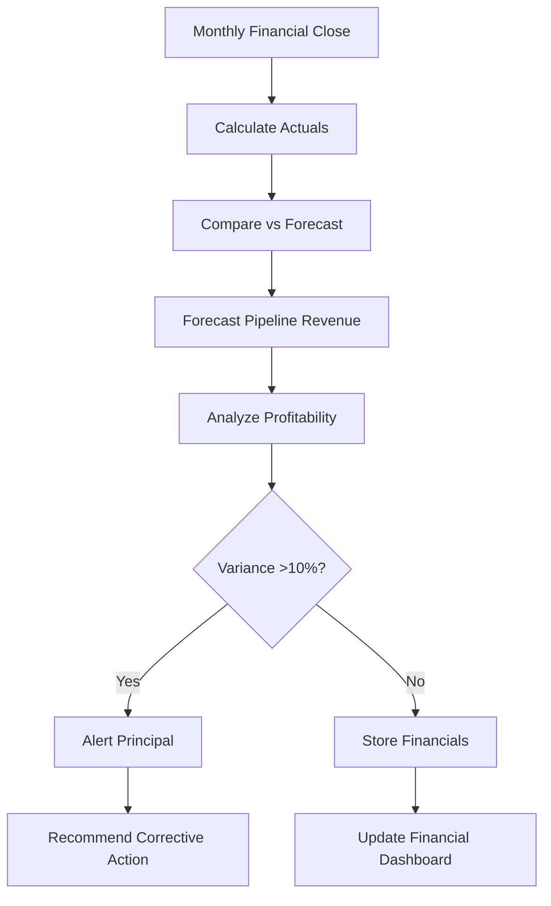

# CFO Agent - Specification

**Purpose**: Financial intelligence - tracks revenue, forecasts pipeline value, monitors profitability, and optimizes pricing strategy

**Build Trigger**: Sprint 7 complete (COO Agent live, financial data flowing)

---

## Overview

The CFO Agent runs **monthly** (automated) and **on-demand** for financial planning. It:
1. **Tracks revenue** (actuals vs forecast, monthly/quarterly trends)
2. **Forecasts pipeline** (weighted probability-based revenue projections)
3. **Monitors profitability** (gross margin by engagement, client, service type)
4. **Optimizes pricing** (recommends rate adjustments based on market data)

**Agent Type**: Financial (automated reporting + strategic planning support)  
**Execution Model**: Hybrid (monthly automated, ad-hoc queries)  
**Human-in-Loop**: Medium (alerts on budget variance, human approves pricing changes)

---

## Architecture

### Tech Stack

```python
# Core dependencies
from neo4j import GraphDatabase
from langchain.agents import AgentExecutor
from langchain_core.prompts import ChatPromptTemplate
from langchain_google_genai import ChatGoogleGenerativeAI
from langchain_core.tools import tool
from firebase_admin import firestore
import pandas as pd
import numpy as np

# Hierarchical Router
class HierarchicalRouter:
    def __init__(self):
        # Gemini Flash for financial queries
        self.gemini_flash = ChatGoogleGenerativeAI(
            model="gemini-2.0-flash-exp",
            temperature=0
        )
```

### Agent Flow



---

## Key Queries & Tools

### Tool 1: Revenue Tracker

**Purpose**: Calculate actual revenue vs forecast (monthly, quarterly, annual)

```python
@tool
def calculate_revenue(period: str = "month") -> str:
    """
    Calculates revenue for specified period.
    Returns: Actuals, forecast, variance, trending.
    """
    with driver.session() as session:
        # Define date range based on period
        if period == "month":
            date_filter = "date() - duration({days: 30})"
        elif period == "quarter":
            date_filter = "date() - duration({days: 90})"
        elif period == "year":
            date_filter = "date() - duration({days: 365})"
        
        result = session.run(f"""
            MATCH (t:Target)
            WHERE t.status = 'closed-won'
              AND t.closed_date >= {date_filter}
            RETURN sum(t.contract_value) AS actual_revenue,
                   count(t) AS deals_closed,
                   avg(t.contract_value) AS avg_deal_size,
                   sum(t.hours_completed * 375) AS billable_revenue
        """)
        
        data = result.single()
        
        # Get forecast from targets (estimated pipeline)
        forecast_result = session.run(f"""
            MATCH (t:Target)
            WHERE t.status IN ['proposal', 'negotiation']
              AND t.expected_close_date >= {date_filter}
              AND t.expected_close_date <= date() + duration({{days: 30}})
            WITH sum(t.estimated_value * t.win_probability) AS weighted_pipeline
            RETURN weighted_pipeline
        """)
        
        forecast_data = forecast_result.single()
        forecast_revenue = forecast_data["weighted_pipeline"] or 0
        
        actual_revenue = data["actual_revenue"] or 0
        variance = actual_revenue - forecast_revenue
        variance_pct = (variance / forecast_revenue * 100) if forecast_revenue > 0 else 0
        
        return {
            "period": period,
            "actual_revenue": actual_revenue,
            "forecast_revenue": forecast_revenue,
            "variance": variance,
            "variance_pct": round(variance_pct, 1),
            "deals_closed": data["deals_closed"],
            "avg_deal_size": data["avg_deal_size"],
            "status": "on-track" if abs(variance_pct) <= 10 else "off-track"
        }
```

---

### Tool 2: Pipeline Forecaster

**Purpose**: Weighted probability forecast of pipeline revenue

```python
@tool
def forecast_pipeline(months_ahead: int = 3) -> str:
    """
    Forecasts revenue from current pipeline using weighted probabilities.
    Returns: Revenue by stage, confidence intervals, best/worst case.
    """
    with driver.session() as session:
        result = session.run("""
            MATCH (t:Target)
            WHERE t.status IN ['qualified', 'engaged', 'proposal', 'negotiation']
              AND (t.expected_close_date IS NULL OR t.expected_close_date <= date() + duration({months: $months}))
            
            WITH t.status AS stage,
                 CASE t.status
                     WHEN 'qualified' THEN 0.10
                     WHEN 'engaged' THEN 0.25
                     WHEN 'proposal' THEN 0.50
                     WHEN 'negotiation' THEN 0.75
                     ELSE 0.05
                 END AS stage_probability,
                 t.estimated_value AS deal_value
            
            RETURN stage,
                   count(*) AS deal_count,
                   sum(deal_value) AS total_pipeline,
                   sum(deal_value * stage_probability) AS weighted_revenue,
                   avg(deal_value) AS avg_deal_size
            ORDER BY 
                CASE stage
                    WHEN 'negotiation' THEN 1
                    WHEN 'proposal' THEN 2
                    WHEN 'engaged' THEN 3
                    WHEN 'qualified' THEN 4
                END
        """, months=months_ahead)
        
        pipeline_data = [dict(record) for record in result]
        
        # Calculate totals
        total_weighted = sum(stage["weighted_revenue"] for stage in pipeline_data)
        best_case = sum(stage["total_pipeline"] for stage in pipeline_data)
        worst_case = total_weighted * 0.7  # Conservative estimate
        
        return {
            "forecast_period_months": months_ahead,
            "by_stage": pipeline_data,
            "weighted_forecast": round(total_weighted, 0),
            "best_case": round(best_case, 0),
            "worst_case": round(worst_case, 0),
            "confidence_interval": f"${round(worst_case, 0):,.0f} - ${round(best_case, 0):,.0f}"
        }
```

**Example Output**:
```python
{
    "forecast_period_months": 3,
    "by_stage": [
        {"stage": "negotiation", "deal_count": 2, "total_pipeline": 180000, "weighted_revenue": 135000, "avg_deal_size": 90000},
        {"stage": "proposal", "deal_count": 3, "total_pipeline": 240000, "weighted_revenue": 120000, "avg_deal_size": 80000},
        {"stage": "engaged", "deal_count": 5, "total_pipeline": 300000, "weighted_revenue": 75000, "avg_deal_size": 60000},
        {"stage": "qualified", "deal_count": 8, "total_pipeline": 400000, "weighted_revenue": 40000, "avg_deal_size": 50000}
    ],
    "weighted_forecast": 370000,
    "best_case": 1120000,
    "worst_case": 259000,
    "confidence_interval": "$259,000 - $1,120,000"
}
```

---

### Tool 3: Profitability Analyzer

**Purpose**: Calculate gross margin by engagement, client, and service type

```python
@tool
def analyze_profitability(group_by: str = "target") -> str:
    """
    Analyzes gross margin (revenue - costs).
    group_by: 'target', 'service_type', or 'quarter'
    Returns: Profitability metrics with margin percentages.
    """
    with driver.session() as session:
        if group_by == "target":
            query = """
                MATCH (t:Target)
                WHERE t.status = 'closed-won'
                OPTIONAL MATCH (t)<-[:VALIDATES]-(e:Note {type: 'engagement'})
                WITH t,
                     sum(e.time_spent_hours) AS total_hours,
                     t.contract_value AS revenue
                RETURN t.name AS category,
                       revenue,
                       total_hours * 150 AS costs,
                       revenue - (total_hours * 150) AS gross_profit,
                       round((revenue - total_hours * 150) / revenue * 100, 1) AS margin_pct
                ORDER BY margin_pct ASC
            """
        elif group_by == "service_type":
            query = """
                MATCH (t:Target)
                WHERE t.status = 'closed-won'
                WITH CASE
                         WHEN t.initium_completed = true THEN 'Initium'
                         WHEN t.fabrica_completed = true THEN 'Fabrica'
                         ELSE 'Other'
                     END AS service_type,
                     sum(t.contract_value) AS revenue,
                     sum(t.hours_completed * 150) AS costs
                RETURN service_type AS category,
                       revenue,
                       costs,
                       revenue - costs AS gross_profit,
                       round((revenue - costs) / revenue * 100, 1) AS margin_pct
                ORDER BY margin_pct DESC
            """
        
        result = session.run(query)
        return [dict(record) for record in result]
```

**Example Output** (by service type):
```python
[
    {"category": "Fabrica", "revenue": 450000, "costs": 225000, "gross_profit": 225000, "margin_pct": 50.0},
    {"category": "Initium", "revenue": 180000, "costs": 108000, "gross_profit": 72000, "margin_pct": 40.0},
    {"category": "Other", "revenue": 50000, "costs": 35000, "gross_profit": 15000, "margin_pct": 30.0}
]
```

---

### Tool 4: Pricing Optimizer

**Purpose**: Recommend rate adjustments based on market positioning and margin targets

```python
@tool
def optimize_pricing() -> str:
    """
    Analyzes current pricing effectiveness and recommends adjustments.
    Returns: Current avg rate, margin analysis, pricing recommendations.
    """
    with driver.session() as session:
        result = session.run("""
            MATCH (t:Target)
            WHERE t.status = 'closed-won'
              AND t.closed_date >= date() - duration({days: 180})
            OPTIONAL MATCH (t)<-[:VALIDATES]-(e:Note {type: 'engagement'})
            WITH t,
                 sum(e.time_spent_hours) AS total_hours,
                 t.contract_value AS revenue
            RETURN avg(revenue / total_hours) AS avg_effective_rate,
                   min(revenue / total_hours) AS min_rate,
                   max(revenue / total_hours) AS max_rate,
                   avg((revenue - total_hours * 150) / revenue) AS avg_margin_pct
        """)
        
        data = result.single()
        avg_rate = data["avg_effective_rate"] or 0
        avg_margin = data["avg_margin_pct"] or 0
        
        # Pricing recommendations
        target_rate = 375  # $375/hour standard rate
        target_margin = 0.50  # 50% gross margin target
        
        recommendations = []
        
        if avg_rate < target_rate * 0.9:
            recommendations.append({
                "issue": "Below-market pricing",
                "current": f"${avg_rate:.0f}/hour",
                "target": f"${target_rate}/hour",
                "action": f"Increase standard rate by {((target_rate / avg_rate) - 1) * 100:.0f}%",
                "impact": f"+${(target_rate - avg_rate) * 160:.0f} per Initium engagement"
            })
        
        if avg_margin < target_margin:
            recommendations.append({
                "issue": "Below-target margins",
                "current": f"{avg_margin * 100:.1f}%",
                "target": "50%",
                "action": "Improve delivery efficiency (reduce scope creep) OR increase rates",
                "impact": f"Need {((target_margin / avg_margin) - 1) * 100:.0f}% margin improvement to hit target"
            })
        
        return {
            "current_avg_rate": round(avg_rate, 2),
            "rate_range": f"${data['min_rate']:.0f} - ${data['max_rate']:.0f}",
            "current_avg_margin": round(avg_margin * 100, 1),
            "target_rate": target_rate,
            "target_margin": target_margin * 100,
            "recommendations": recommendations
        }
```

---

## Agent Prompt

```python
cfo_prompt = ChatPromptTemplate.from_messages([
    ("system", """You are The CFO for Codex Signum consulting practice.

Your job: Track financial health - revenue, pipeline forecasting, profitability, pricing optimization.

Available tools:
- calculate_revenue: Actuals vs forecast (monthly/quarterly/annual)
- forecast_pipeline: Weighted probability revenue projections (3-12 months)
- analyze_profitability: Gross margin by engagement/service/quarter
- optimize_pricing: Rate recommendations based on margin targets

Financial targets:
- **Revenue**: $500K Year 1, $1.2M Year 2 (consulting practice)
- **Gross margin**: 50%+ (target: $150 cost per billable hour, $375 rate)
- **Pipeline coverage**: 3x weighted pipeline vs quarterly revenue target
- **Win rate**: 25% overall, 50% at proposal stage, 75% at negotiation stage

Alert criteria (immediate escalation):
1. Revenue variance >15% vs forecast (2+ consecutive months)
2. Gross margin <40% on any engagement
3. Pipeline coverage <2x quarterly target
4. Avg effective rate <$300/hour (below cost + 50% margin)

Output format:
1. **Financial status** (On-track/At-risk/Critical)
2. **Key metrics** (revenue, pipeline, margin, rates)
3. **Variance analysis** (actuals vs forecast, explanations)
4. **Recommendations** (pricing, pipeline actions, cost controls)

Be data-driven. Principal needs accurate forecasts and actionable financial intelligence."""),
    ("human", "{input}"),
    ("placeholder", "{agent_scratchpad}")
])
```

---

## Implementation Checklist

### Prerequisites
- [ ] Neo4j graph with financial fields (`contract_value`, `estimated_value`, `hours_completed`, `expected_close_date`, `win_probability`)
- [ ] COO Agent operational (provides cost data)
- [ ] Firestore collection: `financial_metrics`
- [ ] Monthly financial close process defined

### Core Functionality
- [ ] Revenue tracker (actuals vs forecast)
- [ ] Pipeline forecaster (weighted probabilities)
- [ ] Profitability analyzer (gross margin calculations)
- [ ] Pricing optimizer (rate recommendations)
- [ ] Alert system for budget variance

### Integration
- [ ] Monthly financial dashboard (key metrics)
- [ ] Quarterly business review reports
- [ ] Cloud Scheduler: Monthly 1st day execution
- [ ] Email digest for Principal

### Testing & Validation
- [ ] Run on 6 months historical data
- [ ] Verify pipeline forecast accuracy (±20% tolerance)
- [ ] Human validation: Are pricing recommendations sound?
- [ ] Test alert thresholds (appropriate sensitivity)

---

## Success Metrics

**Quantitative**:
- ✅ Revenue tracking accuracy: ±5% of actual bookkeeping
- ✅ Pipeline forecast accuracy: ±20% of actual closed revenue
- ✅ Margin calculation accuracy: ±3% of manual calculation
- ✅ Response time: <5 seconds for all financial queries

**Qualitative**:
- ✅ Principal uses financial dashboard monthly for planning
- ✅ Pricing recommendations grounded in data (vs guesswork)
- ✅ Early warnings prevent revenue shortfalls

**Cost Efficiency**:
- **Monthly cost**: $15 (Gemini Flash API ~$10, Cloud Functions ~$5)
- **Time saved**: 3 hours/month (manual financial reporting eliminated)
- **ROI**: 60x ($900 value / $15 cost)

---

## Example Financial Reviews

### Review 1: Monthly Financial Close

**Agent Output** (November 2025):
```
**Financial Status**: ✅ ON-TRACK

**November 2025 Summary**:
- Actual Revenue: $87,500 (vs forecast $85,000, +2.9% variance)
- Deals Closed: 2 (Acme Initium $60K, TechCo Discovery $27.5K)
- Avg Deal Size: $43,750
- Gross Margin: 48.2% (target: 50%, slightly below)

**Year-to-Date** (Jan-Nov):
- Revenue: $380,000 (vs annual target $500K, 76% progress)
- Deals Closed: 12
- Avg Margin: 49.1%
- On-track for Year 1 target (need $120K in December - 2 Fabrica engagements)

**Pipeline Forecast** (Next 3 months):
- Weighted forecast: $185,000
- Best case: $420,000 (if all proposals convert)
- Worst case: $130,000 (conservative 70% of weighted)
- Confidence: $130K - $420K range

**Profitability Analysis** (by service):
- Fabrica: 52% margin (high-value, efficient delivery)
- Initium: 41% margin (scope creep on 2 engagements)
- Discovery: 35% margin (loss leader, converts to Initium/Fabrica)

**Alerts**:
- 🟡 MARGIN: Initium below target (41% vs 50%)
  - Root cause: Scope creep on Acme (+28% hours)
  - **Recommendation**: Implement change order process (see COO Agent alert)

**Recommendations**:
1. ✅ Revenue on-track - maintain current pipeline velocity
2. ⚠️ Improve Initium margins - tighten scope management (see COO recommendations)
3. ✅ December pipeline strong - focus on closing 2 Fabrica proposals to hit annual target
```

---

### Review 2: Pricing Strategy Review

**User Input**: "Should we increase our standard rate?"

**Agent Output**:
```
**Pricing Analysis** (Last 6 months):

**Current Performance**:
- Avg effective rate: $342/hour
- Rate range: $275 - $395/hour (wide variance)
- Avg gross margin: 48.2%
- Target rate: $375/hour
- Target margin: 50%

**Gap Analysis**:
- Current rate is 8.8% below target ($342 vs $375)
- Margin is 1.8% below target (48.2% vs 50%)
- Causes:
  1. Scope creep reduces effective rates (see COO data)
  2. Some engagements priced at $300/hour (legacy rate)

**Pricing Recommendations**:

1. 🔴 IMMEDIATE: Increase standard rate to $375/hour
   - Current clients: Grandfather existing contracts
   - New proposals: Use $375 standard rate (10% increase)
   - Impact: +$5,280 per Initium engagement ($33 × 160 hours)
   - Annual impact: +$63K (assuming 12 engagements/year)

2. 🟡 SHORT-TERM: Implement tiered pricing
   - Discovery: $300/hour (loss leader, converts to higher-value work)
   - Initium: $375/hour (diagnostic)
   - Fabrica: $400/hour (implementation, higher complexity)
   - Retainer: $425/hour (strategic advisory, ongoing)

3. 🟢 LONG-TERM: Value-based pricing pilot
   - Select 2 strategic clients for outcome-based pricing
   - Example: Fabrica at 10% of realized cost savings (vs fixed fee)
   - Potential uplift: 50-100% vs hourly rates

**Risk Assessment**:
- Low risk: 10% rate increase justified by market positioning
- Market data: Strategy consultancies charge $400-600/hour (we're below market)
- Client perception: Position as "premium AI expertise"
- Mitigation: Grandfather existing clients, emphasize ROI in proposals

**Expected Impact**:
- Revenue uplift: +$63K/year (12% increase)
- Margin improvement: 48.2% → 52% (assuming no scope creep increase)
- Pipeline: May reduce win rate by 5% (price sensitivity) - monitor closely

**Recommendation**: ✅ APPROVE rate increase to $375/hour, effective Jan 1, 2026
```

---

## Maintenance & Governance

### Monitoring
- Monthly financial dashboard review (15 min)
- Quarterly business review (deep dive on trends)
- Alert log (track revenue variance patterns)

### Tuning
- Update win probability assumptions (currently 10%/25%/50%/75% by stage) based on historical conversion
- Refine cost assumptions (currently $150/hour) if hiring contractors
- Adjust pricing targets based on market evolution

### Human Oversight
- Principal reviews all pricing recommendations before implementation
- Quarterly: Compare forecast vs actuals (improve model accuracy)
- Annual: Strategic pricing review (market positioning, competitive analysis)

---

## Related Documents

- [[AGENT_REGISTRY.md]] - Agent hierarchy
- [[PHASE_3_IMPLEMENTATION_PLAN.md]] - Sprint 7 implementation
- [[coo-agent-spec.md]], [[strategist-agent-spec.md]] - Dependencies

---

## Changelog

### 2025-11-10 - Version 1.0 (Initial Spec)
- Created CFO Agent specification
- Defined 4 financial tools (revenue, pipeline, profitability, pricing)
- Documented financial workflows and alert thresholds

---

**Last Updated**: 2025-11-10  
**Status**: 🔴 Not Started (Sprint 7 target: Feb 3-16, 2025)  
**Next Review**: After Sprint 7 completion (with COO Agent)
