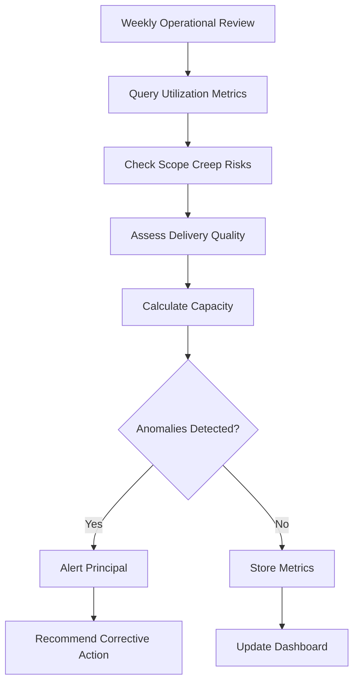

# COO Agent - Specification

**Purpose**: Operational excellence - tracks billable utilization, scope creep risks, delivery quality, and capacity planning

**Build Trigger**: Sprint 6 complete (Strategist Agent live, operational data flowing)

---

## Overview

The COO Agent runs **weekly** (automated + on-demand) to ensure operational health. It:
1. **Monitors utilization** (billable vs non-billable hours)
2. **Detects scope creep** (actual vs estimated hours per engagement)
3. **Tracks delivery quality** (client sentiment, on-time completion)
4. **Plans capacity** (can we take on new engagements?)

**Agent Type**: Operational (automated monitoring + human escalation)  
**Execution Model**: Hybrid (weekly automated, ad-hoc queries)  
**Human-in-Loop**: Medium (alerts on anomalies, human decides corrective action)

---

## Architecture

### Tech Stack

```python
# Core dependencies
from neo4j import GraphDatabase
from langchain.agents import AgentExecutor
from langchain_core.prompts import ChatPromptTemplate
from langchain_google_genai import ChatGoogleGenerativeAI
from langchain_core.tools import tool
from firebase_admin import firestore
import pandas as pd

# Hierarchical Router
class HierarchicalRouter:
    def __init__(self):
        # Gemini Flash for operational queries (cost-effective)
        self.gemini_flash = ChatGoogleGenerativeAI(
            model="gemini-2.0-flash-exp",
            temperature=0
        )
```

### Agent Flow



---

## Key Queries & Tools

### Tool 1: Billable Utilization Tracker

**Purpose**: Measure billable vs non-billable hours (target: 70%+ billable)

```python
@tool
def calculate_billable_utilization(weeks: int = 4) -> str:
    """
    Calculates billable utilization over last N weeks.
    Returns: Percentage, breakdown by activity type, trending.
    """
    with driver.session() as session:
        result = session.run("""
            MATCH (e:Note {type: 'engagement'})
            WHERE e.date >= date() - duration({weeks: $weeks})
            WITH sum(e.time_spent_hours) AS billable_hours
            
            MATCH (n:Note)
            WHERE n.date >= date() - duration({weeks: $weeks})
              AND n.type IN ['research-note', 'learning-registry', 'weekly-review']
            WITH billable_hours, sum(n.time_spent_hours) AS non_billable_hours
            
            RETURN billable_hours,
                   non_billable_hours,
                   billable_hours + non_billable_hours AS total_hours,
                   round(billable_hours / (billable_hours + non_billable_hours) * 100, 1) AS utilization_pct
        """, weeks=weeks)
        
        data = result.single()
        
        return {
            "billable_hours": data["billable_hours"],
            "non_billable_hours": data["non_billable_hours"],
            "total_hours": data["total_hours"],
            "utilization_pct": data["utilization_pct"],
            "status": "healthy" if data["utilization_pct"] >= 70 else "below-target"
        }
```

---

### Tool 2: Scope Creep Detector

**Purpose**: Identify engagements exceeding estimated hours (early warning system)

```python
@tool
def detect_scope_creep() -> str:
    """
    Compares actual vs estimated hours per target.
    Returns: Targets with >20% overage (scope creep risk).
    """
    with driver.session() as session:
        result = session.run("""
            MATCH (t:Target)
            WHERE t.initium_completed = true OR t.fabrica_started = true
            OPTIONAL MATCH (t)<-[:VALIDATES]-(e:Note {type: 'engagement'})
            WITH t,
                 sum(e.time_spent_hours) AS actual_hours,
                 t.estimated_hours AS estimated_hours
            WHERE actual_hours > estimated_hours * 1.2
            RETURN t.name AS target,
                   t.contract_value,
                   estimated_hours,
                   actual_hours,
                   round((actual_hours - estimated_hours) / estimated_hours * 100, 1) AS overage_pct,
                   round(t.contract_value / actual_hours, 2) AS effective_rate
            ORDER BY overage_pct DESC
            LIMIT 10
        """)
        
        return [dict(record) for record in result]
```

**Example Output**:
```python
[
    {
        "target": "Acme Corp - Initium",
        "contract_value": 60000,
        "estimated_hours": 160,
        "actual_hours": 205,
        "overage_pct": 28.1,
        "effective_rate": 292.68  # Below $375/hour target
    }
]
```

---

### Tool 3: Delivery Quality Monitor

**Purpose**: Track client sentiment and on-time completion rates

```python
@tool
def assess_delivery_quality(weeks: int = 12) -> str:
    """
    Measures delivery quality across engagements.
    Returns: Avg sentiment, on-time completion rate, CTA success rate.
    """
    with driver.session() as session:
        result = session.run("""
            MATCH (e:Note {type: 'engagement'})
            WHERE e.date >= date() - duration({weeks: $weeks})
            WITH avg(e.sentiment) AS avg_sentiment,
                 avg(CASE WHEN e.cta_success = true THEN 1.0 ELSE 0.0 END) AS cta_success_rate,
                 count(e) AS total_engagements
            
            MATCH (t:Target)
            WHERE t.deliverable_due_date IS NOT NULL
              AND t.deliverable_due_date >= date() - duration({weeks: $weeks})
            WITH avg_sentiment, cta_success_rate, total_engagements,
                 avg(CASE 
                     WHEN t.deliverable_completed_date <= t.deliverable_due_date 
                     THEN 1.0 
                     ELSE 0.0 
                 END) AS on_time_rate,
                 count(t) AS deliverables_completed
            
            RETURN round(avg_sentiment, 2) AS avg_sentiment,
                   round(cta_success_rate * 100, 1) AS cta_success_pct,
                   round(on_time_rate * 100, 1) AS on_time_pct,
                   total_engagements,
                   deliverables_completed
        """, weeks=weeks)
        
        data = result.single()
        
        return {
            "avg_sentiment": data["avg_sentiment"],
            "cta_success_pct": data["cta_success_pct"],
            "on_time_pct": data["on_time_pct"],
            "total_engagements": data["total_engagements"],
            "deliverables_completed": data["deliverables_completed"],
            "quality_status": "excellent" if data["avg_sentiment"] >= 4.0 else "needs-improvement"
        }
```

---

### Tool 4: Capacity Planner

**Purpose**: Determine if we can accept new engagements based on current workload

```python
@tool
def calculate_capacity(weeks_ahead: int = 4) -> str:
    """
    Forecasts available capacity based on active engagements.
    Returns: Available hours, current commitments, capacity status.
    """
    with driver.session() as session:
        # Get committed hours from active engagements
        result = session.run("""
            MATCH (t:Target)
            WHERE t.status IN ['engaged', 'proposal', 'negotiation']
              AND (t.fabrica_started = true OR t.fabrica_planned = true)
            RETURN sum(t.estimated_hours - t.hours_completed) AS committed_hours,
                   count(t) AS active_projects
        """)
        
        data = result.single()
        committed_hours = data["committed_hours"] or 0
        active_projects = data["active_projects"] or 0
        
        # Assume 40 hours/week capacity, 70% billable target
        total_capacity = weeks_ahead * 40 * 0.7  # 112 hours over 4 weeks
        available_capacity = total_capacity - committed_hours
        
        return {
            "weeks_ahead": weeks_ahead,
            "total_capacity_hours": total_capacity,
            "committed_hours": committed_hours,
            "available_hours": available_capacity,
            "active_projects": active_projects,
            "capacity_status": "available" if available_capacity >= 40 else "at-capacity",
            "can_accept_initium": available_capacity >= 60,  # Initium = 60 hours
            "can_accept_fabrica": available_capacity >= 120  # Fabrica = 120 hours
        }
```

---

## Agent Prompt

```python
coo_prompt = ChatPromptTemplate.from_messages([
    ("system", """You are The COO for Codex Signum consulting practice.

Your job: Monitor operational health - utilization, scope creep, delivery quality, capacity planning.

Available tools:
- calculate_billable_utilization: Track billable vs non-billable hours (target: 70%+)
- detect_scope_creep: Identify engagements exceeding estimates (>20% overage)
- assess_delivery_quality: Monitor sentiment, on-time delivery, CTA success
- calculate_capacity: Forecast available hours for new engagements

Operational thresholds:
- **Utilization**: 70%+ billable (healthy), 60-70% (acceptable), <60% (concern)
- **Scope creep**: <10% overage (healthy), 10-20% (watch), >20% (escalate)
- **Delivery quality**: Sentiment >4.0, CTA success >75%, on-time >90%
- **Capacity**: Available hours >= 40 (can accept Initium), >= 120 (can accept Fabrica)

Alert criteria (immediate escalation):
1. Utilization <60% for 2+ consecutive weeks
2. Scope creep >30% on any engagement
3. Avg sentiment <3.5 or CTA success <60%
4. Committed hours exceed capacity by >20%

Output format:
1. **Operational status** (Healthy/Watch/Alert)
2. **Key metrics** (utilization, scope creep, quality, capacity)
3. **Alerts** (what needs immediate attention)
4. **Recommendations** (corrective actions)

Be proactive. Principal needs early warnings, not post-mortems."""),
    ("human", "{input}"),
    ("placeholder", "{agent_scratchpad}")
])
```

---

## Implementation Checklist

### Prerequisites
- [ ] Neo4j graph with `time_spent_hours` field on engagement notes
- [ ] Targets have `estimated_hours`, `contract_value`, `deliverable_due_date` fields
- [ ] Auditor Agent operational (provides baseline metrics)
- [ ] Firestore collection: `operational_metrics`

### Core Functionality
- [ ] Billable utilization calculator
- [ ] Scope creep detector
- [ ] Delivery quality monitor
- [ ] Capacity planner
- [ ] Alert system (Firestore + optional email)

### Integration
- [ ] Weekly operational dashboard (displays metrics)
- [ ] Alert thresholds configurable (Firestore settings)
- [ ] Cloud Scheduler: Weekly Sunday 6 PM execution
- [ ] Slack/email integration for alerts

### Testing & Validation
- [ ] Run on 3 months historical data
- [ ] Verify scope creep alerts match known overruns
- [ ] Human validation: Are capacity forecasts accurate?
- [ ] Test alert thresholds (not too noisy, not too quiet)

---

## Success Metrics

**Quantitative**:
- ✅ Utilization tracking accuracy: ±5% of manual calculation
- ✅ Scope creep early detection: Alerts 2+ weeks before project completion
- ✅ Capacity forecast accuracy: ±10% of actual available hours
- ✅ Response time: <3 seconds for all operational queries

**Qualitative**:
- ✅ Principal reviews operational dashboard weekly (5 min)
- ✅ Zero scope creep surprises (all overages flagged early)
- ✅ Proactive capacity planning prevents overbooking

**Cost Efficiency**:
- **Monthly cost**: $15 (Gemini Flash API ~$10, Cloud Functions ~$5)
- **Time saved**: 2 hours/week (manual utilization tracking eliminated)
- **ROI**: 53x ($800 value / $15 cost)

---

## Example Operational Reviews

### Review 1: Weekly Operations Report

**Agent Output**:
```
**Operational Status**: ⚠️ WATCH (1 alert, 1 concern)

**Key Metrics** (Last 4 weeks):
- Utilization: 68.5% (Target: 70%+) - Slightly below target
- Active engagements: 3 (Acme Initium, TechCo Fabrica, UniX Discovery)
- Scope creep: 1 engagement flagged (Acme Initium +28%)
- Delivery quality: Sentiment 4.2, CTA success 82%, On-time 90%
- Available capacity: 52 hours over next 4 weeks

**Alerts**:
1. 🔴 SCOPE CREEP: Acme Corp Initium
   - Estimated: 160 hours | Actual: 205 hours (+28%)
   - Effective rate: $292/hour (below $375 target)
   - Root cause: Expanded stakeholder interviews (C1→C2→C3 discovery deeper than planned)
   - **Recommendation**: Negotiate change order (+$10K for expanded scope) OR reduce deliverable depth

**Concerns**:
1. 🟡 UTILIZATION: Trending down (72% → 68% over 2 weeks)
   - Cause: TechCo Fabrica delayed (client scheduling conflicts)
   - **Recommendation**: Fill gap with 1 Initium engagement (60 hours) to maintain 70%+ target

**Capacity Planning**:
- ✅ Can accept: 1 Initium engagement (60 hours available)
- ❌ Cannot accept: Fabrica engagement (need 120 hours, only 52 available)
- **Recommendation**: Wait until TechCo Fabrica completes (2 weeks) before proposing new Fabrica

**Action Items**:
1. Contact Acme Corp PM this week - propose change order for expanded scope
2. Pipeline: Prioritize Initium proposals to fill utilization gap
3. Follow up TechCo - confirm Fabrica deliverable timeline
```

---

### Review 2: Capacity Planning Query

**User Input**: "Can we take on 2 new Initium engagements this month?"

**Agent Output**:
```
**Capacity Analysis** (Next 4 weeks):

**Current Commitments**:
- TechCo Fabrica: 80 hours remaining (due in 3 weeks)
- UniX Discovery: 20 hours remaining (due in 1 week)
- Total committed: 100 hours

**Available Capacity**:
- Total capacity: 112 hours (4 weeks × 40 hours/week × 70% billable target)
- Committed: 100 hours
- Available: 12 hours
- Buffer for non-billable: ~10 hours/week × 4 weeks = 40 hours (already in 30% non-billable allowance)

**Assessment**: ❌ CANNOT ACCEPT 2 INITIUMS

**Reason**:
- 2 Initiuma = 120 hours (60 hours each)
- Available capacity = 12 hours
- Shortfall: 108 hours

**Alternative Recommendations**:
1. ✅ Accept 1 Initium NOW (if client can wait 2 weeks for start)
   - Week 1-2: Complete UniX Discovery (20 hrs), start TechCo Fabrica (40 hrs)
   - Week 3-4: Finish TechCo Fabrica (40 hrs), start Initium (20 hrs)
   - Initium completion in Week 5-6

2. ✅ Accept 2 Initiuma NEXT MONTH (after TechCo completes)
   - Current pipeline clears in 3 weeks
   - Full 112-hour capacity available for dual Initiuma

3. ⚠️ RISKY: Accept both NOW if willing to:
   - Work 55+ hours/week (vs target 40)
   - Accept 85%+ utilization (above 70% target, burnout risk)
   - **Not recommended** without client flexibility on timelines

**Recommendation**: Accept 1 Initium for Week 3-4 start, defer 2nd Initium to Month 2
```

---

## Maintenance & Governance

### Monitoring
- Weekly operational dashboard review (5 min)
- Alert log (track false positives, tune thresholds)
- Quarterly retrospective: Did forecasts match reality?

### Tuning
- Adjust utilization target (currently 70%) based on business model evolution
- Refine scope creep threshold (currently 20%) if too noisy/quiet
- Update capacity assumptions (e.g., if hiring contractors)

### Human Oversight
- Principal reviews all scope creep alerts before client negotiation
- Monthly: Review capacity forecast accuracy (±10% target)
- Feedback loop: Update operational thresholds based on business growth

---

## Related Documents

- [[AGENT_REGISTRY.md]] - Agent hierarchy
- [[PHASE_3_IMPLEMENTATION_PLAN.md]] - Sprint 7 implementation
- [[auditor-agent-spec.md]], [[strategist-agent-spec.md]] - Dependencies

---

## Changelog

### 2025-11-10 - Version 1.0 (Initial Spec)
- Created COO Agent specification
- Defined 4 operational tools (utilization, scope creep, quality, capacity)
- Documented alert thresholds and operational workflows

---

**Last Updated**: 2025-11-10  
**Status**: 🔴 Not Started (Sprint 7 target: Feb 3-16, 2025)  
**Next Review**: After Sprint 6 completion
