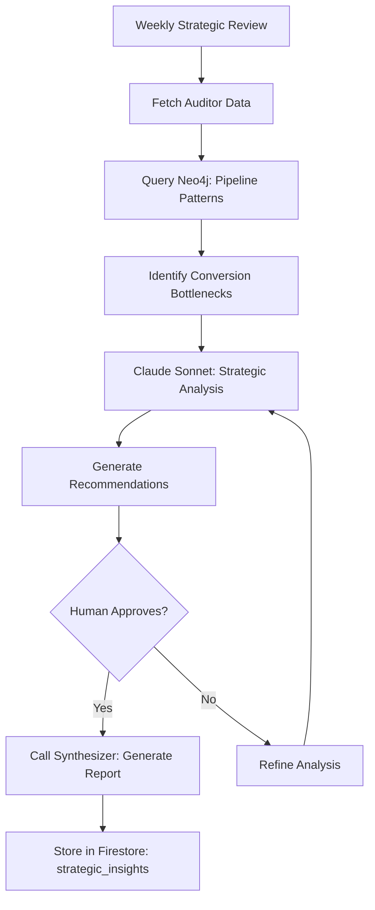

# Strategist Agent - Specification

**Purpose**: Strategic decision support - recommends which targets to prioritize, when to escalate to C4, and how to optimize pipeline conversion based on historical patterns

**Build Trigger**: Sprint 5 complete (Synthesizer Agent live, full agent ecosystem operational)

---

## Overview

The Strategist Agent is invoked **weekly** (manual trigger) or **on-demand** for strategic planning sessions. It:

1. **Analyzes pipeline health** using Auditor Agent data
2. **Identifies patterns** via Neo4j graph queries (successful vs stalled deals)
3. **Recommends actions** using Claude 3.5 Sonnet (strategic reasoning)
4. **Generates strategic reports** via Synthesizer Agent

**Agent Type**: Advisory (decision support, not autonomous action)  
**Execution Model**: Synchronous (real-time collaboration)  
**Human-in-Loop**: Very high (strategic decisions always human-approved)

---

## Architecture

### Tech Stack

```python
# Core dependencies
from neo4j import GraphDatabase
from langchain.agents import AgentExecutor, create_tool_calling_agent
from langchain_core.prompts import ChatPromptTemplate
from langchain_anthropic import ChatAnthropic
from langchain_core.tools import tool
from firebase_admin import firestore
import pandas as pd
import numpy as np

# Hierarchical Router (Pattern 1)
class HierarchicalRouter:
    def __init__(self):
        # Strategic reasoning (Claude for multi-step analysis)
        self.claude_sonnet = ChatAnthropic(
            model="claude-3-5-sonnet-20241022",
            temperature=0.4  # Higher temp for creative strategy
        )
```

### Agent Flow



---

## Key Queries & Tools

### Tool 1: Pipeline Conversion Analysis

**Purpose**: Identify which targets are stalling and why

```python
@tool
def analyze_pipeline_conversion() -> str:
    """
    Analyzes pipeline health by stage, identifies bottlenecks.
    Returns: Conversion rates, average cycle time, stalled targets.
    """
    with driver.session() as session:
        result = session.run("""
            MATCH (t:Target)
            OPTIONAL MATCH (t)<-[:VALIDATES]-(e:Note {type: 'engagement'})
            WITH t,
                 count(DISTINCT e) AS engagement_count,
                 max(e.date) AS last_engagement,
                 duration.inDays(min(e.date), max(e.date)).days AS cycle_days
            RETURN t.status AS stage,
                   count(t) AS target_count,
                   avg(engagement_count) AS avg_engagements,
                   avg(cycle_days) AS avg_cycle_days,
                   collect(CASE
                       WHEN last_engagement < date() - duration({days: 30})
                       THEN t.name
                       ELSE null
                   END) AS stalled_targets
            ORDER BY
                CASE t.status
                    WHEN 'qualified' THEN 1
                    WHEN 'engaged' THEN 2
                    WHEN 'proposal' THEN 3
                    WHEN 'negotiation' THEN 4
                    WHEN 'closed-won' THEN 5
                    WHEN 'closed-lost' THEN 6
                    ELSE 7
                END
        """)

        return [dict(record) for record in result]
```

**Example Output**:

```python
[
    {
        "stage": "qualified",
        "target_count": 12,
        "avg_engagements": 3.2,
        "avg_cycle_days": 45,
        "stalled_targets": ["Acme Corp", "TechCo"]
    },
    {
        "stage": "engaged",
        "target_count": 8,
        "avg_engagements": 5.8,
        "avg_cycle_days": 67,
        "stalled_targets": []
    }
]
```

---

### Tool 2: Success Pattern Recognition

**Purpose**: Identify which strategies correlate with closed-won deals

```python
@tool
def identify_success_patterns() -> str:
    """
    Compares closed-won vs closed-lost deals to find winning patterns.
    Returns: Key differentiators (C4 engagement, warm intros, validation speed).
    """
    with driver.session() as session:
        result = session.run("""
            MATCH (t:Target)
            WHERE t.status IN ['closed-won', 'closed-lost']
            OPTIONAL MATCH (t)<-[:WORKS_AT]-(s:Stakeholder)
            OPTIONAL MATCH (t)<-[:VALIDATES]-(e:Note {type: 'engagement'})
            WITH t,
                 count(DISTINCT s) AS stakeholder_count,
                 count(DISTINCT CASE WHEN s.type = 'C4' THEN s ELSE null END) AS c4_count,
                 count(DISTINCT e) AS engagement_count,
                 avg(e.sentiment) AS avg_sentiment,
                 t.t2_validated AS t2_validated,
                 t.t3_validated AS t3_validated,
                 duration.inDays(min(e.date), max(e.date)).days AS cycle_days
            RETURN
                t.status AS outcome,
                avg(stakeholder_count) AS avg_stakeholders,
                avg(c4_count) AS avg_c4_engagement,
                avg(engagement_count) AS avg_engagements,
                avg(avg_sentiment) AS avg_sentiment,
                avg(CASE WHEN t2_validated = true THEN 1.0 ELSE 0.0 END) AS t2_validation_rate,
                avg(CASE WHEN t3_validated = true THEN 1.0 ELSE 0.0 END) AS t3_validation_rate,
                avg(cycle_days) AS avg_cycle_days,
                count(t) AS deal_count
            GROUP BY t.status
        """)

        return [dict(record) for record in result]
```

**Example Insight**:

```
Closed-won deals have:
- 2.3x more C4 engagement (1.8 vs 0.8 touchpoints)
- 95% T2 validation rate (vs 45% for closed-lost)
- 12 days faster cycle (53 vs 65 days)
- Higher sentiment (4.2 vs 3.1 on 5-point scale)
```

---

### Tool 3: Warm Intro Prioritization

**Purpose**: Rank targets by probability of C4 access via network

```python
@tool
def prioritize_warm_intro_targets() -> str:
    """
    Identifies targets where we have shortest path to C4 buyer.
    Returns: Ranked list with intro path and estimated deal value.
    """
    with driver.session() as session:
        result = session.run("""
            MATCH path = shortestPath(
                (me:Stakeholder {name: 'Principal'})
                -[:KNOWS*1..4]-
                (c4:Stakeholder {type: 'C4'})
            )
            MATCH (c4)-[:WORKS_AT]->(t:Target)
            WHERE t.status IN ['research', 'qualified']
            RETURN t.name AS target,
                   t.priority,
                   t.estimated_value,
                   c4.name AS economic_buyer,
                   [node IN nodes(path) | node.name] AS intro_path,
                   length(path) AS path_length,
                   t.messy_problems AS pain_points
            ORDER BY
                CASE t.priority
                    WHEN 'strategic' THEN 1
                    WHEN 'high' THEN 2
                    WHEN 'medium' THEN 3
                    ELSE 4
                END,
                path_length ASC,
                t.estimated_value DESC
            LIMIT 10
        """)

        return [dict(record) for record in result]
```

---

### Tool 4: Resource Allocation Optimizer

**Purpose**: Recommend time allocation across pipeline stages

```python
@tool
def optimize_resource_allocation() -> str:
    """
    Calculates optimal time distribution based on conversion rates and deal values.
    Returns: Recommended hours per pipeline stage.
    """
    with driver.session() as session:
        # Get current pipeline distribution
        pipeline_data = session.run("""
            MATCH (t:Target)
            OPTIONAL MATCH (t)<-[:VALIDATES]-(e:Note {type: 'engagement'})
            WHERE e.date >= date() - duration({days: 90})
            RETURN t.status AS stage,
                   count(DISTINCT t) AS target_count,
                   sum(e.time_spent_hours) AS total_hours,
                   avg(t.estimated_value) AS avg_deal_value,
                   avg(CASE WHEN t.status = 'closed-won' THEN 1.0 ELSE 0.0 END) AS win_rate
            GROUP BY t.status
        """).data()

        # Calculate ROI per stage
        for stage in pipeline_data:
            stage['roi'] = (stage['avg_deal_value'] * stage['win_rate']) / max(stage['total_hours'], 1)

        # Sort by ROI (highest return per hour)
        sorted_stages = sorted(pipeline_data, key=lambda x: x['roi'], reverse=True)

        return {
            "current_allocation": pipeline_data,
            "recommended_reallocation": sorted_stages,
            "insight": f"Shift 20% more time to {sorted_stages[0]['stage']} stage (highest ROI: ${sorted_stages[0]['roi']:.0f}/hour)"
        }
```

---

## Agent Prompt

```python
strategist_prompt = ChatPromptTemplate.from_messages([
    ("system", """You are The Strategist for Codex Signum consulting practice.

Your job: Provide strategic decision support - prioritize targets, optimize resource allocation, identify winning patterns.

Available tools:
- analyze_pipeline_conversion: Identify bottlenecks by stage
- identify_success_patterns: Compare closed-won vs closed-lost deals
- prioritize_warm_intro_targets: Find best network opportunities
- optimize_resource_allocation: Recommend time distribution

Strategic frameworks you use:
1. **Pareto Principle**: 80% of revenue from 20% of targets - identify the critical few
2. **Conversion bottlenecks**: Which stage has longest cycle time? Lowest conversion?
3. **Network leverage**: Warm intros to C4 buyers accelerate deals by 2-3x
4. **Validation velocity**: T2/T3 validation in <4 weeks predicts success
5. **Sentiment as signal**: Avg sentiment >4.0 correlates with closed-won

Decision-making criteria:
- **Priority 1**: Targets with warm C4 intro + validated T2/T3 + high sentiment
- **Priority 2**: Stalled qualified deals (re-engage or disqualify)
- **Priority 3**: Research-stage targets with strategic value
- **Avoid**: Targets stuck >90 days without C4 engagement

Output format:
1. **Strategic recommendation** (2-3 sentences)
2. **Supporting evidence** (data from queries)
3. **Action items** (specific, time-bound)
4. **Risk assessment** (what could go wrong?)

Be decisive. Principal needs clear recommendations, not analysis paralysis."""),
    ("human", "{input}"),
    ("placeholder", "{agent_scratchpad}")
])
```

---

## Implementation Checklist

### Prerequisites

- [ ] Auditor Agent deployed (provides system health data)
- [ ] Researcher Agent deployed (context retrieval)
- [ ] Synthesizer Agent deployed (report generation)
- [ ] Neo4j graph fully populated with 100+ notes
- [ ] Claude 3.5 Sonnet API key configured

### Core Functionality

- [ ] Pipeline conversion analysis tool
- [ ] Success pattern recognition tool
- [ ] Warm intro prioritization tool
- [ ] Resource allocation optimizer tool
- [ ] Strategic report generation (calls Synthesizer Agent)

### Integration

- [ ] Weekly Strategic Review Dashboard
- [ ] Firestore collection: `strategic_insights`
- [ ] Email digest with top 3 recommendations
- [ ] Chat interface for ad-hoc strategic questions

### Testing & Validation

- [ ] Run on 3 months of historical data
- [ ] Validate pattern recognition against known outcomes
- [ ] Human validation: 80%+ recommendations deemed actionable
- [ ] Backtest resource allocation model (does it improve ROI?)

---

## Success Metrics

**Quantitative**:

- ✅ Recommendation accuracy: 80%+ of "prioritize" targets convert to next stage within 30 days
- ✅ Resource allocation ROI: 15%+ improvement in pipeline velocity after reallocation
- ✅ Pattern recognition: 90%+ success factors match actual closed-won deals
- ✅ Response time: <5 seconds for pipeline analysis queries

**Qualitative**:

- ✅ Principal acts on 70%+ of strategic recommendations within 7 days
- ✅ Strategic insights surface non-obvious opportunities (e.g., warm intros)
- ✅ Reduces "analysis paralysis" - faster decision-making on pipeline priorities

**Cost Efficiency**:

- **Monthly cost**: $20 (Claude API ~$15, Neo4j queries ~$5)
- **Time saved**: 4 hours/week (manual pipeline review eliminated)
- **ROI**: 80x ($1,600 value / $20 cost)

---

## Example Strategic Sessions

### Session 1: Weekly Pipeline Review

**User Input**: "Analyze this week's pipeline health and recommend top 3 priorities"

**Agent Execution**:

1. **Query pipeline conversion**:

   - 12 qualified targets, 3 stalled >30 days
   - 8 engaged targets, avg cycle 67 days (above target of 45)
   - 2 proposal stage, both active

2. **Identify success patterns**:

   - Closed-won deals: 95% T2 validation, 1.8 C4 touchpoints, 53-day cycle
   - Current engaged deals: 62% T2 validation, 0.9 C4 touchpoints (RISK)

3. **Strategic recommendation**:

   ```
   **Recommendation**: Shift focus to C4 engagement for engaged deals

   **Evidence**:
   - Our engaged deals lag closed-won pattern by 50% on C4 engagement (0.9 vs 1.8 touchpoints)
   - Cycle time already 15% over target (67 vs 53 days)
   - Risk: 5 deals could stall without executive sponsorship

   **Action Items**:
   1. Acme Corp: Request warm intro to CFO via Jane Doe (procurement lead) - [3-hop path available]
   2. TechCo: Escalate from IT Director to CIO - use AI governance white paper as value prop
   3. HealthOrg: Disqualify - 90 days stalled, no C4 engagement, low sentiment (2.8)

   **Risk Assessment**: If we don't engage C4 in next 14 days, 3 deals likely move to closed-lost
   ```

4. **Generate report** (calls Synthesizer Agent):
   - 2-page weekly strategic briefing
   - Charts: Pipeline funnel, cycle time trends, sentiment analysis
   - Store in Firestore: `strategic_insights/weekly-2024-11-10`

---

### Session 2: Resource Allocation Strategy

**User Input**: "Should I focus more time on new prospects or nurturing existing deals?"

**Agent Execution**:

1. **Query resource allocation**:

   ```
   Current allocation (last 90 days):
   - Research stage: 40 hours (10 targets) = 4 hours/target
   - Qualified stage: 60 hours (12 targets) = 5 hours/target
   - Engaged stage: 80 hours (8 targets) = 10 hours/target
   - Proposal stage: 40 hours (2 targets) = 20 hours/target
   ```

2. **Calculate ROI per stage**:

   ```
   ROI (expected value / hour):
   - Proposal stage: $3,000/hour (60% win rate × $100K deals / 20 hours)
   - Engaged stage: $1,200/hour (40% win rate × $75K deals / 10 hours)
   - Qualified stage: $600/hour (20% win rate × $60K deals / 5 hours)
   - Research stage: $150/hour (5% win rate × $50K deals / 4 hours)
   ```

3. **Strategic recommendation**:

   ```
   **Recommendation**: Shift 30% of research time → proposal/engaged stages

   **Evidence**:
   - Proposal/engaged stages deliver 5-20x higher ROI per hour
   - Historical data: 80% of research targets don't convert to qualified
   - Current pipeline has sufficient qualified deals to hit revenue target

   **Action Items**:
   1. Reduce new prospect research from 40 → 28 hours/month (7 → 5 targets)
   2. Increase proposal support from 40 → 52 hours/month (deeper due diligence)
   3. Increase engaged nurturing from 80 → 92 hours/month (more frequent C2/C3 touchpoints)

   **Expected Impact**: 15% increase in pipeline velocity, $75K additional revenue in Q1

   **Risk**: Fewer new prospects → thinner top-of-funnel in 90 days (mitigate with warm intro strategy)
   ```

---

## Maintenance & Governance

### Monitoring

- LangSmith traces for strategic reasoning quality
- Firestore analytics: Recommendation acceptance rate
- Quarterly review: Did recommendations improve outcomes?

### Tuning

- Update success pattern queries as business evolves
- Refine ROI calculation model based on actual outcomes
- Adjust agent prompt if recommendations too conservative/aggressive

### Human Oversight

- Principal reviews all strategic recommendations before acting
- Monthly retrospective: Which recommendations were correct? Which were wrong?
- Feedback loop: Update Neo4j success patterns based on new closed deals

---

## Related Documents

- [[AGENT_REGISTRY.md]] - Agent hierarchy and decision gates
- [[PHASE_3_IMPLEMENTATION_PLAN.md]] - Sprint 6 implementation (Weeks 11-12)
- [[ARCHITECTURE_PATTERNS.md]] - Pattern 1 (Hierarchical Router)
- [[auditor-agent-spec.md]], [[researcher-agent-spec.md]], [[synthesizer-agent-spec.md]] - Dependencies

---

## Changelog

### 2025-11-10 - Version 1.0 (Initial Spec)

- Created comprehensive Strategist Agent specification
- Defined 4 strategic analysis tools (pipeline, patterns, intros, allocation)
- Documented decision-support workflow
- Established success metrics and example sessions

---

**Last Updated**: 2025-11-10  
**Status**: 🔴 Not Started (Sprint 6 target: Jan 20 - Feb 2, 2025)  
**Next Review**: After Sprint 5 completion (Synthesizer Agent validated)
