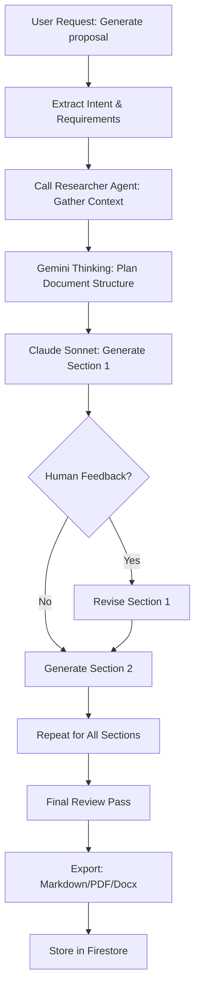

# Synthesizer Agent - Specification

**Purpose**: Generate polished business documents (proposals, reports, insights) by synthesizing knowledge graph context into client-ready artifacts

**Build Trigger**: Sprint 3 complete (Researcher Agent live, hybrid RAG functional)

---

## Overview

The Synthesizer Agent is invoked **on-demand** to create business deliverables. It:
1. **Retrieves context** via Researcher Agent (hybrid RAG)
2. **Structures content** using best practices (e.g., MECE frameworks, pyramid principle)
3. **Generates drafts** using Claude 3.5 Sonnet (high-quality prose)
4. **Iterates with human** in real-time (collaborative editing)

**Agent Type**: Reactive (user-triggered)  
**Execution Model**: Synchronous (real-time collaboration)  
**Human-in-Loop**: High (collaborative co-creation)

---

## Architecture

### Tech Stack

```python
# Core dependencies
from langchain.agents import AgentExecutor, create_tool_calling_agent
from langchain_core.prompts import ChatPromptTemplate
from langchain_anthropic import ChatAnthropic
from langchain_google_genai import ChatGoogleGenerativeAI
from langchain_core.tools import tool
from firebase_admin import firestore
import markdown
import pdfkit

# Hierarchical Router (Pattern 1)
class HierarchicalRouter:
    def __init__(self):
        # Reasoning mode for structure planning
        self.gemini_thinking = ChatGoogleGenerativeAI(
            model="gemini-2.0-flash-thinking-exp", 
            temperature=1
        )
        # High-quality prose generation
        self.claude_sonnet = ChatAnthropic(
            model="claude-3-5-sonnet-20241022",
            temperature=0.3
        )
        
    def route(self, task_type: str):
        if task_type == "structure":
            return self.gemini_thinking  # Use thinking mode for planning
        else:
            return self.claude_sonnet  # Use Claude for writing
```

### Agent Flow



---

## Key Tools

### Tool 1: Retrieve Context (via Researcher Agent)

**Purpose**: Gather all relevant knowledge before writing

```python
@tool
def retrieve_context_for_writing(topic: str, target_org: str = None) -> str:
    """
    Calls Researcher Agent to gather context for document generation.
    Returns: Structured context object with sources.
    """
    from researcher_agent import hybrid_search
    
    # Build query
    query = f"{topic} related to {target_org}" if target_org else topic
    
    # Retrieve via Researcher Agent
    results = hybrid_search(query, entity_hint=target_org, top_k=15)
    
    # Format for synthesis
    context = {
        "topic": topic,
        "target_org": target_org,
        "sources": [
            {
                "title": r["note_title"],
                "content": r["content"],
                "rrf_score": r["rrf_score"],
                "note_id": r["note_id"]
            }
            for r in results
        ]
    }
    
    return context
```

**Example**:
```python
# User: "Generate Initium proposal for Acme Corp"
retrieve_context_for_writing("Initium diagnostic methodology", target_org="Acme Corp")
# Returns: 15 notes on Acme Corp + general Initium templates
```

---

### Tool 2: Plan Document Structure (Gemini Thinking Mode)

**Purpose**: Use reasoning mode to create MECE document outline before writing

```python
@tool
def plan_document_structure(doc_type: str, context: dict, requirements: dict) -> str:
    """
    Uses Gemini 2.0 Flash Thinking to plan document structure.
    Returns: Detailed outline with section headers and key points.
    """
    from langchain_google_genai import ChatGoogleGenerativeAI
    
    llm = ChatGoogleGenerativeAI(model="gemini-2.0-flash-thinking-exp", temperature=1)
    
    prompt = f"""You are a strategy consultant planning a {doc_type}.

Context:
{context}

Requirements:
- Target audience: {requirements.get('audience', 'C-suite executives')}
- Length: {requirements.get('length', '5-8 pages')}
- Tone: {requirements.get('tone', 'professional, evidence-based')}

Task: Create a MECE (Mutually Exclusive, Collectively Exhaustive) outline using pyramid principle.

Output format:
# Document Title
## Executive Summary (1 page)
- Key finding 1
- Key finding 2
[...]

## Section 1: [Title]
- Subsection 1.1: [Topic]
  * Key point
  * Evidence from [[Note Title]]
[...]

Guidelines:
- Lead with answer (pyramid principle)
- Use evidence from provided context
- Cite sources as [[Note Title]]
- Structure logically (problem → solution → implementation)
"""
    
    response = llm.invoke(prompt)
    return response.content
```

---

### Tool 3: Generate Section (Claude Sonnet)

**Purpose**: Write polished prose for each document section

```python
@tool
def generate_section(section_outline: str, context: dict, style: str = "professional") -> str:
    """
    Uses Claude 3.5 Sonnet to generate section content.
    Returns: Markdown-formatted prose with citations.
    """
    from langchain_anthropic import ChatAnthropic
    
    llm = ChatAnthropic(model="claude-3-5-sonnet-20241022", temperature=0.3)
    
    prompt = f"""You are a strategy consultant writing a business document.

Section to write:
{section_outline}

Available context:
{context}

Style guidelines:
- Tone: {style}
- Use active voice
- Concrete examples over abstract concepts
- Cite sources as [[Note Title]]
- Use markdown formatting (headers, lists, bold)

Write the section now (400-600 words):
"""
    
    response = llm.invoke(prompt)
    return response.content
```

---

### Tool 4: Refine with Feedback

**Purpose**: Iteratively improve section based on human input

```python
@tool
def refine_section(original_text: str, feedback: str, context: dict) -> str:
    """
    Revises section based on human feedback.
    Returns: Updated markdown text.
    """
    from langchain_anthropic import ChatAnthropic
    
    llm = ChatAnthropic(model="claude-3-5-sonnet-20241022", temperature=0.3)
    
    prompt = f"""You are revising a document section based on feedback.

Original text:
{original_text}

Feedback:
{feedback}

Available context (if you need more evidence):
{context}

Revise the text to address feedback while maintaining professional tone and citation standards.
"""
    
    response = llm.invoke(prompt)
    return response.content
```

---

## Agent Prompt

```python
synthesizer_prompt = ChatPromptTemplate.from_messages([
    ("system", """You are The Synthesizer for Codex Signum consulting practice.

Your job: Transform raw knowledge into polished business documents (proposals, reports, insights).

Workflow:
1. **Gather context**: Call retrieve_context_for_writing to get relevant notes
2. **Plan structure**: Call plan_document_structure (uses Gemini Thinking for MECE outline)
3. **Write iteratively**: Call generate_section for each part
4. **Refine with feedback**: Call refine_section when human provides input
5. **Export**: Provide final document in Markdown (user can convert to PDF/Docx)

Quality standards:
- **Pyramid principle**: Lead with answer, then supporting evidence
- **MECE sections**: Mutually exclusive, collectively exhaustive
- **Evidence-based**: Cite sources as [[Note Title]] - every claim needs attribution
- **Active voice**: "We recommend X" not "It is recommended that X"
- **Concrete examples**: Prefer case studies over abstract concepts

Document types you create:
- **Initium proposals**: Problem, approach, deliverables, pricing (5-8 pages)
- **Fabrica reports**: Findings, insights, recommendations (10-15 pages)
- **Market insights**: Pattern analysis across multiple clients (3-5 pages)
- **Weekly summaries**: Performance metrics + key developments (2 pages)

Collaboration mode:
- Show outline before writing (get human approval on structure)
- Generate one section at a time (easier to review)
- Ask clarifying questions if requirements unclear

Be thorough but concise. Principal needs client-ready deliverables, not academic papers."""),
    ("human", "{input}"),
    ("placeholder", "{agent_scratchpad}")
])
```

---

## Implementation Checklist

### Prerequisites
- [ ] Researcher Agent deployed and functional
- [ ] Claude 3.5 Sonnet API key configured
- [ ] Gemini 2.0 Flash Thinking API access
- [ ] Markdown-to-PDF export library (pdfkit or similar)
- [ ] Firestore collection for draft documents

### Core Functionality
- [ ] Context retrieval tool (calls Researcher Agent)
- [ ] Structure planning tool (Gemini Thinking mode)
- [ ] Section generation tool (Claude Sonnet)
- [ ] Refinement tool (iterative editing)
- [ ] Export functionality (Markdown, PDF, Docx)

### Integration
- [ ] Chat interface for collaborative editing
- [ ] Real-time preview (markdown rendering)
- [ ] Version history (Firestore document versions)
- [ ] Template library (Initium, Fabrica, Insight templates)

### Testing & Validation
- [ ] Generate 3 test proposals (Initium, Fabrica, Market Insight)
- [ ] Human validation: 90%+ sections require <2 revisions
- [ ] Citation accuracy: 95%+ sources verifiable
- [ ] Export quality: PDFs render correctly with formatting

---

## Success Metrics

**Quantitative**:
- ✅ Document quality: 90%+ sections require ≤2 revisions
- ✅ Citation coverage: 95%+ claims include [[sources]]
- ✅ Generation time: <10 minutes for 5-page document (excluding human review)
- ✅ Export success: 100% of documents render correctly in PDF

**Qualitative**:
- ✅ Client-ready output: 80%+ generated proposals sent to clients with <30 min editing
- ✅ Principal uses Synthesizer 3+ times/week (vs writing from scratch)
- ✅ Reduces proposal writing time from 4 hours → 1 hour (75% time savings)

**Cost Efficiency**:
- **Monthly cost**: $25 (Claude API ~$15, Gemini Thinking ~$10)
- **Time saved**: 10 hours/month (proposal/report writing)
- **ROI**: 40x ($1,000 value / $25 cost)

---

## Example Workflows

### Workflow 1: Generate Initium Proposal

**User Input**:
```
Generate Initium proposal for Acme Corp. 
Audience: C-suite (CEO, CFO, CIO)
Length: 6 pages
Focus: AI governance diagnostic
```

**Agent Execution**:
1. **Retrieve context**:
   - Calls Researcher Agent: "Initium methodology AND Acme Corp"
   - Returns: 15 notes (Acme engagements, Initium templates, similar diagnostics)

2. **Plan structure** (Gemini Thinking):
   ```markdown
   # Initium AI Governance Diagnostic - Acme Corp
   
   ## Executive Summary (1 page)
   - Problem: Legacy data silos blocking AI adoption [[TARGET-Acme-Corp]]
   - Solution: 4-week diagnostic to assess readiness
   - Value: De-risk $2M AI investment
   
   ## Section 1: Your Challenge (1 page)
   - Context: Acme's AI ambitions [[ENG-2024-11-05-Acme-Call]]
   - Blockers: Data governance gaps [[LEARN-2024-10-15-DataGov]]
   
   ## Section 2: Our Approach (2 pages)
   - Phase 1: Stakeholder interviews (C1/C2/C3)
   - Phase 2: Technical assessment (data maturity)
   - Phase 3: Roadmap development
   
   ## Section 3: Deliverables (1 page)
   - Gap analysis report
   - 12-month implementation roadmap
   - Risk mitigation plan
   
   ## Section 4: Investment (1 page)
   - 4 weeks @ $15k/week = $60k
   - ROI: De-risk $2M investment, accelerate AI deployment by 6 months
   ```

3. **Generate each section** (Claude Sonnet):
   - Writes Section 1 with context from [[TARGET-Acme-Corp]]
   - Principal reviews: "Add more emphasis on procurement pain points"
   - Calls `refine_section` with feedback
   - Repeats for Sections 2-4

4. **Export**:
   - Markdown → PDF conversion
   - Store in Firestore (`proposals/acme-initium-2024-11-10`)
   - Provide download link

**Time**: 8 minutes generation + 20 minutes human review = **28 minutes total** (vs 4 hours manual)

---

### Workflow 2: Generate Market Insight

**User Input**:
```
Synthesize market insight: "How do enterprise clients approach AI vendor selection?"
Include data from last 6 months of engagements.
Length: 3 pages
```

**Agent Execution**:
1. **Retrieve context**:
   - Researcher Agent query: "vendor selection criteria enterprise AI"
   - Returns: 20 engagement notes across 8 different clients

2. **Plan structure** (Gemini Thinking):
   - Pattern 1: Risk aversion drives multi-vendor evaluation
   - Pattern 2: Compliance requirements vary by industry (FinServ vs Healthcare)
   - Pattern 3: C4 sponsors accelerate deals, C3 gatekeepers slow them
   - Pattern 4: Pricing objections focus on ROI proof, not absolute cost

3. **Generate** (Claude Sonnet):
   - 3-page report with pattern analysis
   - Cites 12 different engagement notes
   - Includes tactical recommendations

4. **Store**: Firestore `insights/vendor-selection-2024-11-10`

**Time**: 6 minutes generation + 10 minutes review = **16 minutes total**

---

## Maintenance & Governance

### Monitoring
- LangSmith traces for generation quality debugging
- Firestore analytics: Document types generated, revision counts
- Monthly review: Are citations accurate? Is tone appropriate?

### Tuning
- Update prompt if output too verbose/concise
- Adjust Claude temperature (currently 0.3) for creativity vs consistency
- Refine document templates based on client feedback

### Human Oversight
- Principal reviews all client-facing documents before sending
- Quarterly audit: 20 random documents checked for citation accuracy
- Feedback loop: Flag low-quality sections to improve prompts

---

## Related Documents

- [[AGENT_REGISTRY.md]] - Agent hierarchy and decision gates
- [[PHASE_3_IMPLEMENTATION_PLAN.md]] - Sprint 4-5 implementation (Weeks 7-10)
- [[ARCHITECTURE_PATTERNS.md]] - Pattern 1 (Hierarchical Router)
- [[researcher-agent-spec.md]] - Context retrieval dependency

---

## Changelog

### 2025-11-10 - Version 1.0 (Initial Spec)
- Created comprehensive Synthesizer Agent specification
- Defined 4 core tools (retrieve, plan, generate, refine)
- Documented collaborative writing workflow
- Established success metrics and example workflows

---

**Last Updated**: 2025-11-10  
**Status**: 🔴 Not Started (Sprint 4-5 target: Dec 23 - Jan 19, 2025)  
**Next Review**: After Sprint 3 completion (Researcher Agent validated)
